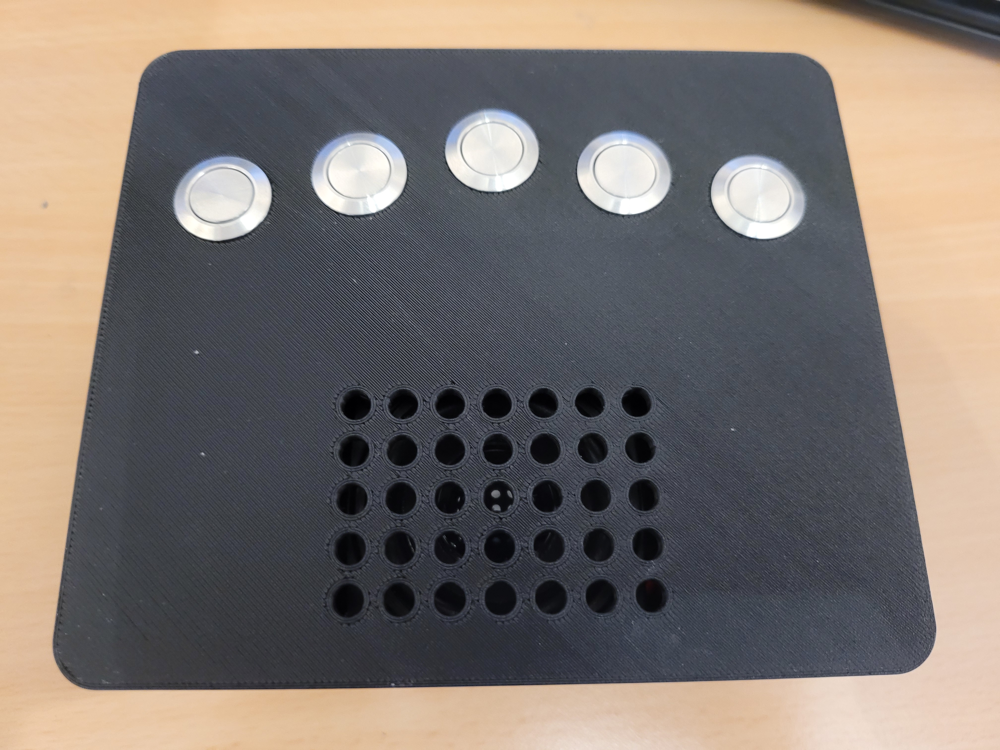
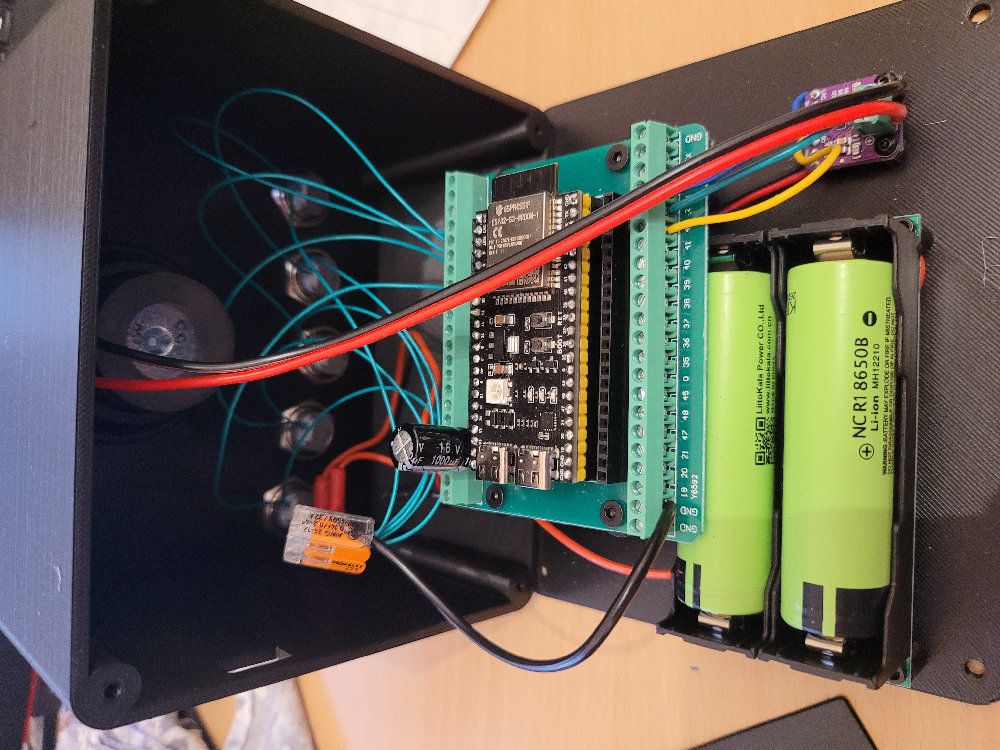

# Example Build

<p float="left">
  
  
</p>

This page describes a complete example setup for MelodiESP, including the hardware components and the Home Assistant configuration. This particular example is built around **Spotify** integration via Music Assistant, but the setup can be adapted to suit your own needs (different music sources, automations, etc.).

## 📋 Component Set

> **Note**: The links and prices below are provided as examples from the time of purchase and may no longer be accurate. They are for reference only.

| Component | Example Reference | Qty | Notes | Link | Price (€) |
|---|---|---|---|---|---|
| ESP32-S3 DevKit | ESP32-S3-DevKitC-1 N16R8 | 1 | 16 MB Flash, 8 MB PSRAM (octal) | [Here](https://fr.aliexpress.com/item/1005006418608267.html) | 7.29 |
| I2S Amplifier | MAX98357A breakout board | 1 | 3W mono Class D amplifier, I2S input | [Here](https://fr.aliexpress.com/item/1005007068815767.html) | 1.25 |
| Speaker | 4Ω / 3W full-range driver | 1 | Size to match your enclosure, only one of the 2 is used | [Here](https://fr.aliexpress.com/item/1005006867491648.html) | 5.59 |
| Push Buttons | 16 mm switches | 5 | Normally open, panel-mount | [Here](https://fr.aliexpress.com/item/1005004920346156.html) | 2.47 |
| Power Switch | Toggle switch | 1 | Used to cut power | [Here](https://fr.aliexpress.com/item/4000973563250.html) | 0.99 |
| Screw Terminal Adapter | Breakout board for ESP32 | 1 | Eases mount/unmount with screw terminal blocks | [Here](https://fr.aliexpress.com/item/1005008790807170.html) | 2.55 |
| Power Supply (with battery holder) | 5V / 3A with USB-C | 1 | Pick one with battery for standalone operation | [Here](https://fr.aliexpress.com/item/1005007183936785.html) | 2.84 |
| Battery | 18650 Li-ion battery | 2 | 2 batteries for longer autonomy | [Here](https://fr.aliexpress.com/item/32771532107.html) | 7.79 |

**Total (without wires and 3D prints): ~40.65 €**

> **Tip**: If you want to use different GPIO pins for the I2S amplifier or the buttons, update the pin assignments in [`melodiesp.yaml`](melodiesp.yaml).

## 🎨 Enclosure & 3D Design

The project includes a custom robot-themed enclosure provided as an **OpenSCAD** source:
- **Parametric Source**: `robot.scad` allows you to customize the box size, thickness, and component mounting by adjusting variables in the file.
- **Parts Included**: The script generates both the **Front Panel** (with speaker grid and button holes) and the **Back Panel** (with standoffs).
- **How to Export**: Open `robot.scad` in [OpenSCAD](https://openscad.org/), adjust the `part_to_show` variable to select a part, then render (F6) and export as STL or 3MF for printing.

## 🏠 Home Assistant Configuration

The MelodiESP is connected as a media player (named `melodiesp`) and integrated into Music Assistant (named `melodiesp_ma`).

The 5 buttons are named `binary_sensor.melodiesp_music_1` to `binary_sensor.melodiesp_music_5`.

Music Assistant is connected to a Spotify account and button presses play Spotify tracks.

This setup includes:
- An automation to handle button presses
- An automation to play a sound when the device connects to Home Assistant
- A dashboard to select the music to play when pressing buttons

### Prerequisites

This configuration requires the following add-ons / custom cards:
- [Music Assistant](https://music-assistant.io/) — HACS add-on for media management
- [mini-media-player](https://github.com/kalkih/mini-media-player) — custom Lovelace card
- [bubble-card](https://github.com/Clooos/Bubble-Card) — custom Lovelace card

You also need to provide your own sound files placed in your Home Assistant media folder at `local/sounds/`:
- `startup.mp3` — played when MelodiESP connects
- `play.mp3` — played when a new track starts
- `pause.mp3` — played when playback is paused

### Entities

To store the music links, I created 5 `input_text` entities in Home Assistant, named `mesp_music_1` to `mesp_music_5`.

To store whether or not Spotify Radio mode should be used, I created an `input_boolean` entity named `mesp_radio_mode`.

### Dashboard

```yaml
type: custom:vertical-stack-in-card
cards:
  - type: markdown
    content: "## ⚙️ MelodiESP Configuration"
  - type: entities
    title: Spotify Links
    show_icon: false
    entities:
      - entity: input_text.mesp_music_1
        name: Music 1
      - entity: input_text.mesp_music_2
        name: Music 2
      - entity: input_text.mesp_music_3
        name: Music 3
      - entity: input_text.mesp_music_4
        name: Music 4
      - entity: input_text.mesp_music_5
        name: Music 5
  - type: custom:mini-media-player
    entity: media_player.melodiesp_ma
    volume_state: true
    artwork: cover
    info: scroll
    hide:
      power: true
  - type: custom:bubble-card
    card_type: button
    show_state: true
    name: Radio Mode
    entity: input_boolean.mesp_radio_mode
```

### Automations

#### Startup

This automation relies on the `startup.mp3` sound file mentioned in the prerequisites above.

```yaml
alias: MelodiESP - Startup
description: Play a sound when MelodiESP is connected
triggers:
  - entity_id: media_player.melodiesp
    from: unavailable
    trigger: state
actions:
  - variables:
      # Here we do not use the Music Assistant media player but the ESPHome media player
      target: media_player.melodiesp
      old_volume: "{{ state_attr('media_player.melodiesp', 'volume_level') | float(0.3) }}"
      startup_volume: 0.5
      startup_sound: media-source://media_source/local/sounds/startup.mp3
  - action: media_player.volume_set
    target:
      entity_id: "{{ target }}"
    data:
      volume_level: "{{ startup_volume }}"
  - delay: "00:00:00.200"
  - action: media_player.play_media
    target:
      entity_id: "{{ target }}"
    data:
      media:
        media_content_id: "{{ startup_sound }}"
        media_content_type: audio/mpeg
        metadata: {}
  - delay: "00:00:05.000"
  - action: media_player.volume_set
    target:
      entity_id: "{{ target }}"
    data:
      volume_level: "{{ old_volume }}"
mode: restart
```

#### Buttons

What it does:
- **Short press**: Plays the music associated with the button.
- **Short press (same track playing)**: Toggles pause/resume.
- **Long press on button 3** (> 0.5s): Toggles radio mode.
- **Long press on button 2** (> 0.5s): Previous track.
- **Long press on button 4** (> 0.5s): Next track.
- **Long press on button 1 or 5** (> 0.5s): Decreases or increases the volume.
- Plays a sound notification when a new track starts.

```yaml
alias: MelodiESP - Buttons
description: ""
triggers:
  - entity_id:
      - binary_sensor.melodiesp_music_1
      - binary_sensor.melodiesp_music_2
      - binary_sensor.melodiesp_music_3
      - binary_sensor.melodiesp_music_4
      - binary_sensor.melodiesp_music_5
    from: "off"
    to: "on"
    trigger: state
conditions: []
actions:
  - variables:
      player_entity: media_player.melodiesp_ma
      # Retrieve the button ID from the trigger entity ID (so that we get the number 1 to 5)
      button_id: "{{ trigger.entity_id.split('_')[-1] | int }}"
      # Retrieve the media ID from the input_text entity associated with the button ID
      media_id: "{{ states('input_text.mesp_music_' ~ button_id) }}"
      # Retrieve the spotify ID from the media ID (so that we get the spotify ID)
      spotify_id: "{{ media_id.split('/')[-1].split('?')[0] }}"
      # Retrieve the media running from the media player entity (so that we get the currently played spotify ID)
      media_running: "{{ state_attr(player_entity, 'media_content_id') | default('', true) }}"
      # Check if the media is the same as the one that is running
      is_same_media: "{{ spotify_id in media_running }}"
      # Check if the radio mode is enabled
      is_radio_mode: "{{ is_state('input_boolean.mesp_radio_mode', 'on') }}"
      # Sound files
      play_sound: media-source://media_source/local/sounds/play.mp3
      pause_sound: media-source://media_source/local/sounds/pause.mp3

  # Wait for the button to be released to know if it was a short press or a long press
  - wait_for_trigger:
      - trigger: template
        value_template: "{{ is_state(trigger.entity_id, 'off') }}"
    timeout: "00:00:00.500"

  # If the button was not released, it was a long press
  - if:
      - condition: template
        value_template: "{{ wait.trigger is none }}"
    then:
      - choose:

          # Handle long press for button 3 (radio mode)
          - conditions:
              - condition: template
                value_template: "{{ button_id == 3 }}"
            sequence:
              - action: input_boolean.toggle
                target:
                  entity_id: input_boolean.mesp_radio_mode

          # Handle long press for button 2 (previous track)
          - conditions:
              - condition: template
                value_template: "{{ button_id == 2 }}"
            sequence:
              - action: media_player.media_previous_track
                target:
                  entity_id: "{{ player_entity }}"

          # Handle long press for button 4 (next track)
          - conditions:
              - condition: template
                value_template: "{{ button_id == 4 }}"
            sequence:
              - action: media_player.media_next_track
                target:
                  entity_id: "{{ player_entity }}"

          # Handle long press for button 1 and 5 (volume)
          # Button 1 is volume down, button 5 is volume up
          - conditions:
              - condition: template
                value_template: "{{ button_id in [1, 5] }}"
            sequence:
              - repeat:
                  while:
                    - condition: template
                      value_template: "{{ is_state(trigger.entity_id, 'on') }}"
                  sequence:
                    - action: media_player.volume_set
                      target:
                        entity_id: "{{ player_entity }}"
                      data:
                        volume_level: >
                           
                            {{ [current + 0.05, 0.75] | min }}
                          
                            {{ [current - 0.05, 0.2] | max }}
                          
                    - delay: "00:00:00.300"

    # If the button was released, it was a short press
    else:
      - choose:

          # If the same media is playing, pause or resume it if it's already paused
          - conditions:
              - condition: template
                value_template: "{{ is_same_media }}"
            sequence:
              - action: media_player.media_play_pause
                target:
                  entity_id: "{{ player_entity }}"

        default:
          # If the media is different, play it
          - action: media_player.play_media
            target:
              entity_id: "{{ player_entity }}"
            data:
              media:
                media_content_id: "{{ play_sound }}"
                media_content_type: music
                metadata: {}
          - delay: "00:00:02.000"
          - target:
              entity_id: "{{ player_entity }}"
            data:
              media_id: "{{ media_id }}"
              media_type: track
              radio_mode: "{{ is_radio_mode }}"
              enqueue: replace
            action: music_assistant.play_media
mode: single
```